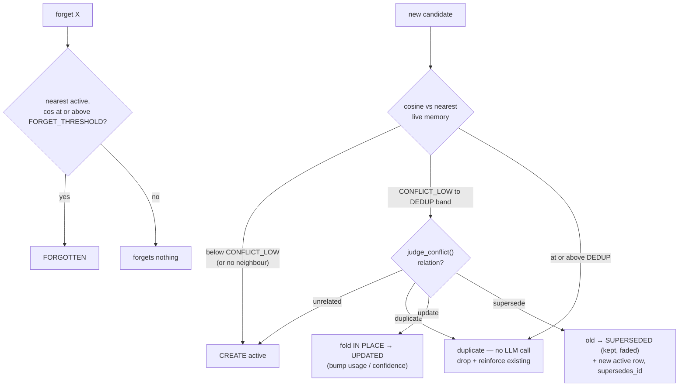

# Design

## Core idea: split judgment from mechanics

A memory system does two kinds of work, and mixing them is what makes these
systems unreliable and impossible to debug:

- **Judgment** (needs a model): *is this worth remembering? does this new fact
  contradict an old one, or just refine it?* → LLM.
- **Mechanics** (same input → same output): cosine similarity, thresholds, status
  transitions, decay, ranking, trace assembly. → plain Python.

So the LLM owns exactly three calls (all in `llm.py`): **extract**, **judge_conflict**,
**reply**. Everything else is deterministic code. The two judgment calls use Groq
**structured output** (`json_schema`, `strict`), so a decision comes back as a typed
object you can store, render, and assert on — never free text to re-parse. When a
memory is superseded, there's a typed `{relation, reason}` on record saying why.

## The pipeline (one pass per turn)

`memory.py::process_turn` runs six stages, one trace row each:

1. **extract**: `Candidate[]` (text, scope, quoted evidence, confidence) + optional `forget_request`. Chit-chat → empty.
2. **embed**: local (`fastembed`, bge-base, 768-d).
3. **dedup**: nearest live memory. If cosine ≥ `DEDUP_THRESHOLD` it's a duplicate **in code, no LLM call** — drop + reinforce. A near-identical embedding isn't ambiguous, so spending a judge call on it is waste.
4. **conflict**: only the ambiguous band `[CONFLICT_LOW, DEDUP_THRESHOLD)` reaches `judge_conflict`. Its `relation` drives a deterministic state transition (below).
5. **retrieve**: pull from the vec index, keep live rows above `RETRIEVE_THRESHOLD`, rank by **cosine × decay**, take top *k*, reinforce. Each row records cosine, decay, score, rank. Optional hybrid path (BM25 + rerank, behind `USE_BM25`/`USE_RERANK`) off by default.
6. **reply**: answers using the retrieved memories; trace records which ids were in context + token/latency cost.

Thresholds and decay constants all live in one block in `config.py`.

## State machine: canonical memories + revisions

A memory has a **stable id** and a `memory_revisions` timeline. A **refinement**
updates the row in place (same id). A **contradiction** is *invalidate-not-delete*:
the old row is parked at `superseded` (kept, faded, still inspectable) and a **new
active row** takes over, linked via `supersedes_id`. Nothing is destroyed — "what
did I believe, and when" stays answerable (the bi-temporal idea from Zep/Graphiti).



Four states: `active`/`updated` are **live** (retrievable, valid neighbours —
`LIVE_STATUSES` is the single gate); `superseded`/`forgotten` are resting (shown
in the inspector, not retrieved). A refined row keeps its decay strength
(`use_count`/`last_used_at` not reset), so a long-reinforced fact stays ranked when
sharpened. The LLM only picks refine-vs-contradict; the mutation, linkage,
confidence formula (`c + STEP·(1−c)`), and revision writes are deterministic.

## Decay

Relevance isn't just similarity — a fact mentioned once a month ago should rank
below one referenced constantly. `decay.py`:

```
decay_score = recency_weight(last_used_at) × usage_weight(use_count), clamped [DECAY_FLOOR, 1]
```

- **recency** — exponential half-life (`DECAY_HALF_LIFE_DAYS`, 14). A retrieval resets the clock.
- **usage** — starts at `USAGE_BASE` (0.6), saturates toward 1 with use.
- Computed **at read time**, never stored stale. Faded memories drop in rank, never deleted.

Final ranking `cosine × decay`, so a slightly-less-similar but fresh memory can
outrank a stale exact match — and the trace shows both numbers.

## The trace is the product

Every turn writes one `traces` row per stage. That's the answer to *"why did it
say that / use that memory?"*: extract (candidates + confidence), dedup (what
dropped, against what, at what similarity), conflict (relation + reason + action),
retrieve (every row's cosine/decay/score/rank), reply (ids in context + cost).

`GET /traces/{message_id}` returns the ordered list; the UI renders a per-turn
drawer. `GET /metrics` is a **fold over the same traces** (dedup rate, supersede
count, avg similarity, token/latency) — no separate counters to drift.

## Frontend: everything visible, Nothing design

Three-pane shell: **chat** (assistant-ui), **memory inspector** (cards with text,
scope, status, evidence, reason, confidence, decay bar, revision timeline,
edit/forget/delete), **trace + metrics**. Visual language is **Nothing design,
light mode**: printed-manual feel, off-white page, shadowless white cards,
monochrome with status color on the *value* (green active, amber updated, red
superseded). Mono ALL-CAPS labels; data is the visual — `cos 0.83 · decay 0.74 ·
rank 1` needs no decoration.

## Trade-offs (deliberate)

- **SQLite + sqlite-vec + local embeddings** over Postgres/pgvector + hosted vector
  DB: single-box demo where setup friction and inspectability beat horizontal
  scale. One file, one command, one API key. At scale you swap the store — that
  change lands only in `store.py`.
- **Local embeddings (bge-base, 768-d)** trade some recall for zero extra keys and
  offline operation. Retrieval is this corpus's main accuracy lever, so it's worth
  the size; `scripts/reembed.py` migrates a DB when model/dim change.
- **At most one judge call per candidate** — deterministic gates consult the LLM
  *only* in the ambiguous band, keeping cost bounded and every judgment on record.
- **Degrades, doesn't crash.** Groq strict `json_schema` fails on a fraction of
  requests under load; `llm._structured` gives each call a timeout + bounded retry,
  then a safe fallback (extract → no candidates, conflict → fresh fact, reply →
  apology) recorded in the trace. One turn degrades instead of 500-ing.
- **Concurrency: one connection, two locks.** `_lock` serializes each write+commit;
  a per-conversation `turn_lock` wraps the whole read→judge→write turn so
  same-conversation turns serialize while different conversations run in parallel.
- **`gpt-oss-20b` for judgment, `gpt-oss-120b` for replies** — cheap/fast model with
  `reasoning_effort: low` for per-turn judgment, larger model for replies. Both ids
  are one line in `config.py`; swapping LLM provider touches only `llm.py` + `config.py`.

## Accuracy levers (measured / deferred)

Accuracy = **retrieval** (right memory reaches the reply) + **judgment**
(extract/dedup/conflict). The pipeline isolates them.

**Taken — embedding upgrade.** `scripts/eval_retrieval.py` scores a fixed set with
confusable distractors. The retrieval stack was at its ceiling on short facts (BM25
fusion *regresses* on lexical noise), so embedding quality is the real lever:
bge-small (384-d) → **bge-base (768-d)**, one-line config + reembed. Side effect:
the cross-encoder rerank stopped being a no-op (`vec+rerank` Recall@3 0.786 → 0.857)
— now a justified flag, kept off pending a larger eval.

**Deferred (documented):** full bi-temporal `valid_from`/`valid_to` windows (wants
a graph store; Graphiti scores 63.8% vs Mem0 49.0% on LongMemEval,
[arXiv:2501.13956](https://arxiv.org/abs/2501.13956)); entity tagging (`gliner`) to
key dedup/forget on the subject, not whole-sentence cosine; per-scope thresholds.
Every lever is measured before shipping or left as a typed config knob — never a
silent prompt tweak.
